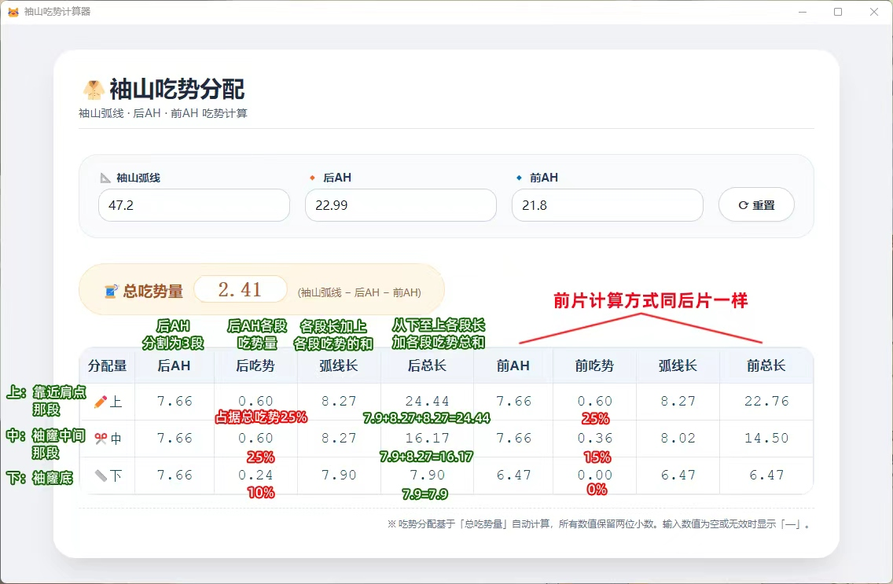

# 说明文档

## 计算原理

## 功能
根据袖山弧线、后AH、前AH自动计算总吃势量，并分段（上/中/下）分配吃势到后片与前片。

## 输入项
- 袖山弧线（例：47.2）
- 后AH（例如：22.99）
- 前AH（例如：21.8）

- 重置按钮：清空所有输入

## 计算结果
- **总吃势量** = 袖山弧线 − 后AH − 前AH  
  示例：47.2 − 22.99 − 21.8 = 2.41
- **后片**：后AH均分三段，按上、中、下分配吃势（上多下少）。  
  示例：每段弧长7.66，吃势分别为0.60、0.60、0.24，修正后袖山弧段长分别为8.27、8.27、7.90。
- **前片**：逻辑同后片，按前AH长度重新计算。

## 使用步骤
1. 输入三个长度值（支持小数）。
2. 自动计算并显示各段吃势及修正后弧长。
3. 点击“重置”清空数据。

## 注意事项
- 吃势分配采用经典“上多下少”规则。
- 所有数值保留两位小数。
- 输入无效时显示「—」。
